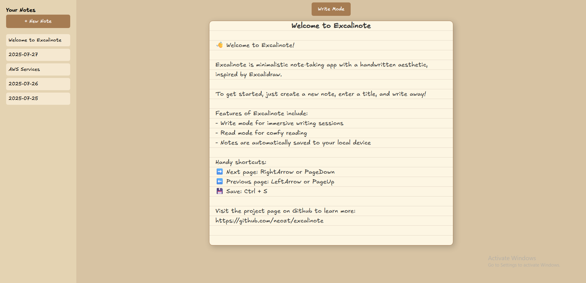

# Excalinote

Simple note-taking app with handwritten aesthetic inspired by Excalidraw.

Access the website here - https://excalinote.neozt.dev/

## ✨ Features
✅Create multiple notes with custom titles  
✅Write Mode - write in vertical scrolling format for immersive writing sessions  
✅Read Mode - read text in pages for the traditional notebook vibes  
🛠️Save notes locally (WIP)  
🛠️Save notes to the cloud (WIP)  

## 📸 Screenshots

Write Mode:

Read Mode:

## 🛠️ Stack

- Angular
- TypeScript

## 🚀 Getting Started

1. Run `npm run start` to start a local development server at `http://localhost:4200`.

## 📦 Deployment

- The webapp is deployed to AWS S3 and served via AWS Cloudfront.

## Acknowledgements

This project draws inspiration from [Excalidraw](https://excalidraw.com/).  
[Excalifont](https://plus.excalidraw.com/excalifont) provided by Excalidraw under MIT License.  

